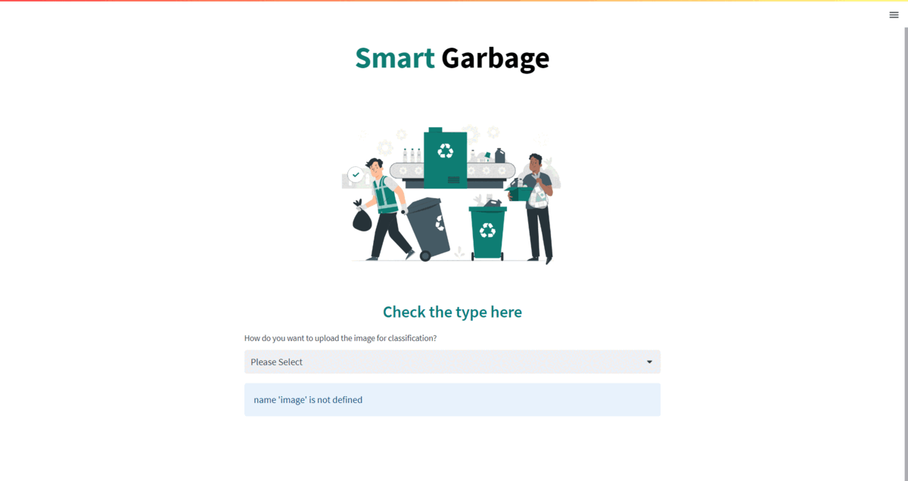

# ♻️ **Smart Garbage Segregation**

> *"Turning trash into tech — one image at a time"*

  
   
  <a href="https://drive.google.com/file/d/1FttMlM96K5njpDYt_v4MtVvyPX62REhj/view">🎥 Watch Video</a> • 
  <a href="https://raison024-smart-garbage-segregation-deploymentapp-lfq9yb.streamlit.app/">🚀 Live Demo</a> • 
  <a href="https://github.com/raison024/Smart-Garbage-Segregation/issues">🐞 Report Bug</a> • 
  <a href="https://github.com/raison024/Smart-Garbage-Segregation/issues">💡 Suggest Feature</a>

  

---

## 🌟 **What is Smart Garbage Segregation?**

An **AI-powered waste sorting system** that uses **image classification** to automatically identify and segregate waste into categories like **plastic, paper, and metal**.
Our mission: make recycling **faster**, **smarter**, and **more sustainable**.

  

  

---

## 💡 **Why We Built This**

🌍 **The Problem**

* **2.01 billion tons** of waste generated annually
* **33%** is *not* safely managed
* **8 million metric tons** of plastic enter oceans yearly (enough to cover every shoreline with **5 grocery bags** of plastic per foot)

🛠 **The Solution**

* Automate waste sorting with **AI + ML**
* Reduce human error and labor costs
* Increase recycling rates & environmental sustainability

---

## 🛠 **Tech Stack**

| Category          | Tools & Tech                                     |
| ----------------- | ------------------------------------------------ |
| **Frameworks**    | TensorFlow, Intel oneAPI, oneDNN                 |
| **Languages**     | Python                                           |
| **Deployment**    | Streamlit                                        |
| **Core Concepts** | CNNs, Image Classification, Real-Time Processing |

---

## 🚀 **How It Works**

1️⃣ **Capture Image** → Waste image taken via camera
2️⃣ **Process** → Preprocessing & resizing
3️⃣ **Classify** → CNN model predicts category
4️⃣ **Sort** → Directs waste to correct bin

📈 **Continuous Learning** – Model improves with each new dataset.

---

## 🌱 **Impact**

* ♻ **Better Recycling** – More recoverable materials
* 👷 **Less Manual Labor** – Safer, faster sorting
* 🏭 **Industry-Ready** – Can integrate with existing recycling lines
* 📚 **Awareness** – Educates public on proper waste management

---

## 🏆 **What We Learned**

* Optimizing deep learning models with **Intel oneDNN**
* Handling **real-world image noise** in classification
* Deploying **interactive AI apps** with Streamlit
* Designing **scalable AI pipelines**

---

  <b>🌍 Small step for code, giant leap for cleaner Earth.</b>  
     
  ♻ Built with ❤️ by a team passionate about **AI for Sustainability**

  

